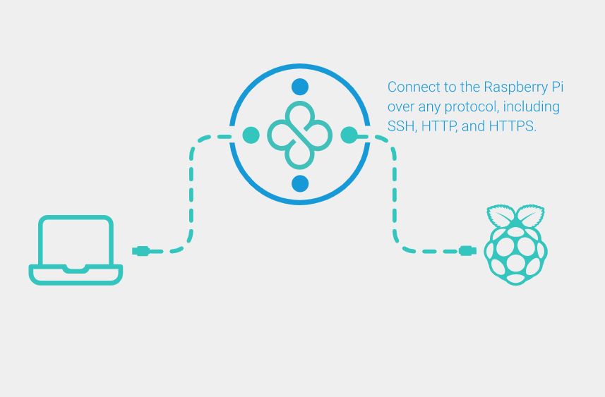
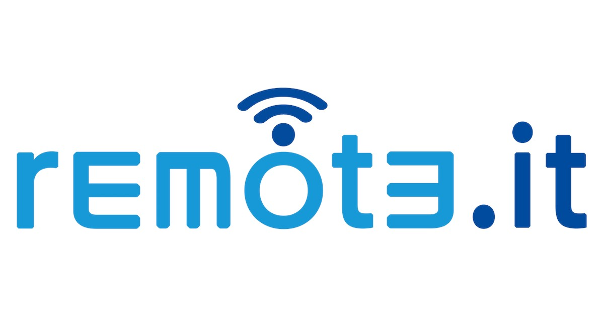
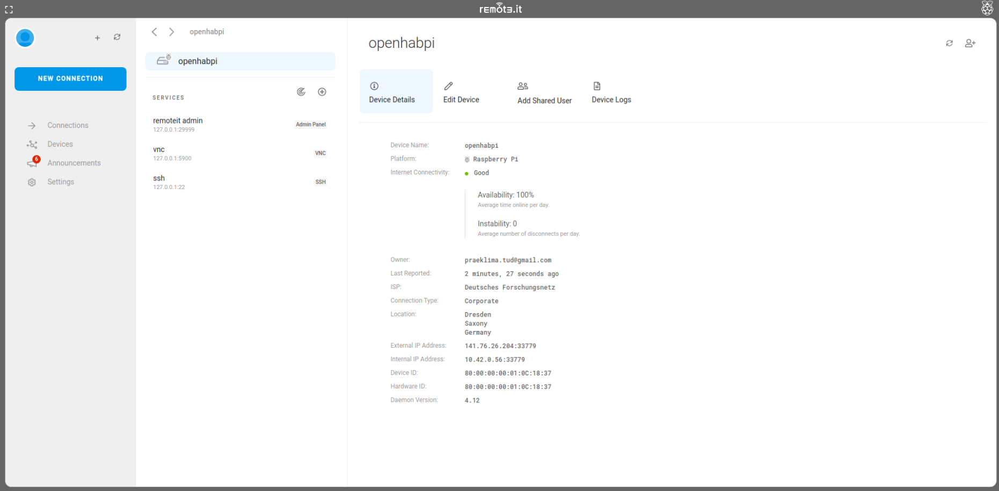
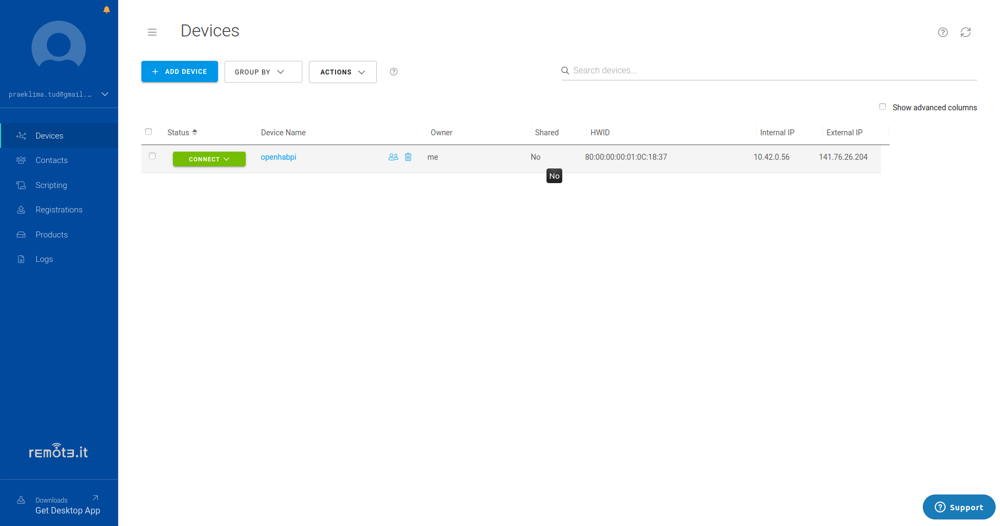
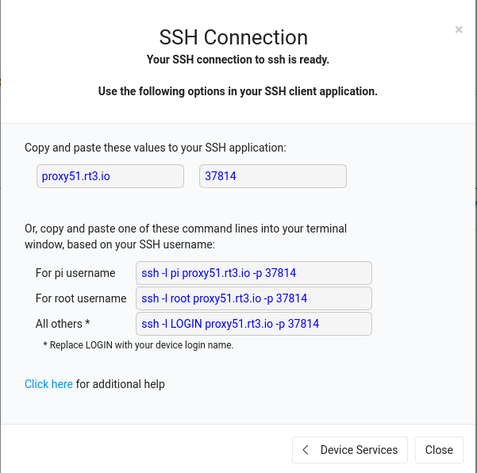

#Cloud Proxy Server / Third party port forwarding 
The main advantage of using a cloud proxy server is that users arenot required to forward any port from their local router, thus significantly reducting the network’s vulnerability.



Using remote.it (one of the service provider), as an example, instead of opening a port from your home router and await incoming connection (which could be you or hackers), users could set up a VPN (remote.it put it as VPI, which is similar to VPN) between Pi and the cloud proxy server. Whenever users want to access the Pi later, user will actually connect to the cloud proxy server, which will be served to deliver data packages between Pi and users.

##Set up cloud proxy server with remote.it



###Step 1: Sign up an account on remote.it
Here you go: https://app.remote.it/auth/#/sign-up

###Step 2: Install remoteit on your Raspberry Pi

SSH into your Raspberry Pi (If you want to know how to SSH please check out my part-1 of the series), then run

```shell
sudo apt update
sudo apt install remoteit
```

Once its done, you will see the following output
```shell
====================================================================
Continue your device configuration at 
http://find.remote.it
or http://raspberrypi.local:29999
or http://192.168.1.243:29999
====================================================================
```

###Step 3: Add your Pi device to remote.it
First, make sure your local PC is connected to the same wifi (LAN) as the Pi. Then visit http://find.remote.it, and you shall see there is one device discovered. Click Connect , and login with your new account.

You will then be directed to register a new device. In the device registration page, you will be ask to provided a name for the device. After filling in the device name, please make sure that “ssh” service is selected as we wish to ssh into the Pi remotely.


###Step 4: Access your Pi anywhere

The setup is now finished! And you are ready to access your Pi anywhere (yes, even on a different lan/wifi!). Simply head to https://app.remote.it/, and login with your account. You shall see your Pi as one of the device on the welcome dashboard.


Click the connect dropdown (The Green Button) and select “SSH”. Wait for a few seconds and you should see a pop-up box with an IP address and port number. This is the address for the cloud proxy server.



Now, Open your powershell from Window (if you are Mac/Unix then open your terminal), and simply run the ssh command shown in the pop-up box

And you are IN! Which means that going forward you just need to have a web-browser ready and you can connect to your Pi anywhere you want!
