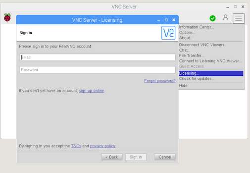
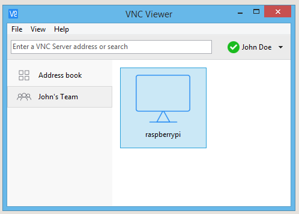

# Real VNC server for RaspberryPi
VNC is a graphical desktop sharing system that allows you to remotely control the desktop interface of one computer (running VNC Server) from another computer or mobile device (running VNC Viewer). VNC Viewer transmits the keyboard and either mouse or touch events to VNC Server, and receives updates to the screen in return.

```shell
sudo apt update
sudo apt install realvnc-vnc-server realvnc-vnc-viewer
```


## Enabling VNC Server

You can do this graphically or at the command line.
Enabling VNC Server graphically

* On your Raspberry Pi, boot into the graphical desktop.
* Select Menu > Preferences > Raspberry Pi Configuration > Interfaces.
* Ensure VNC is Enabled.

## Enabling VNC Server at the command line

You can enable VNC Server at the command line using raspi-config:

```shell
sudo raspi-config
```

Now, enable VNC Server by doing the following:

* Navigate to Interfacing Options.
* Scroll down and select VNC > Yes.


## Creating a virtual desktop

If your Raspberry Pi is headless (i.e. not plugged into a monitor) or controlling a robot, it is unlikely to be running a graphical desktop.

VNC Server can create a virtual desktop for you, giving you graphical remote access on demand. This virtual desktop exists only in your Raspberry Pi's memory:

```shell
run vncserver
```

## Connecting to your Raspberry Pi with VNC Viewer

There are two ways to connect to your Raspberry Pi. You can use either or both, depending on what works best for you.

### Establishing a cloud connection

You are entitled to use RealVNC's cloud service for free, provided that remote access is for educational or non-commercial purposes only.

Cloud connections are convenient and encrypted end-to-end. They are highly recommended for connecting to your Raspberry Pi over the internet. There's no firewall or router reconfiguration, and you don't need to know the IP address of your Raspberry Pi, or provide a static one.

* Sign up for a RealVNC account here: it's free and it only takes a few seconds.
* On your Raspberry Pi, sign in to VNC Server using your new RealVNC account credentials:



* On the device you'll use to take control, download VNC Viewer. You must use the compatible app from RealVNC.
* Sign in to VNC Viewer using the same RealVNC account credentials, and then either tap or click to connect to your Raspberry Pi: (Real VNC viewer is recommended)




