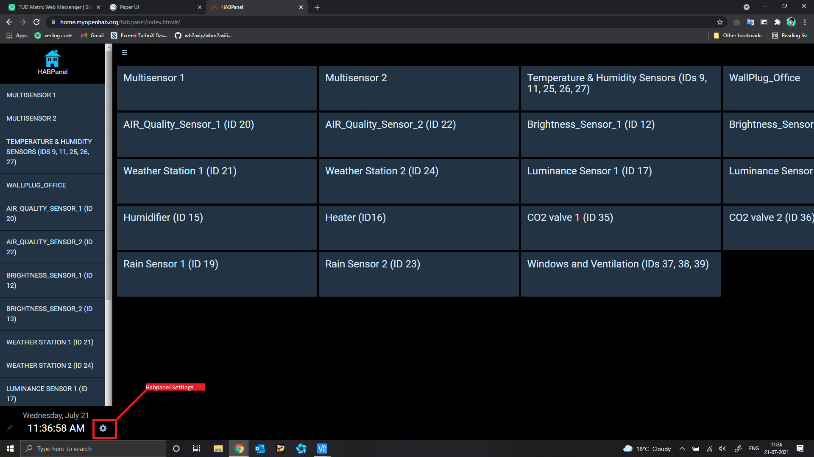
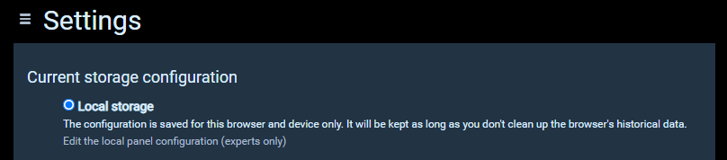
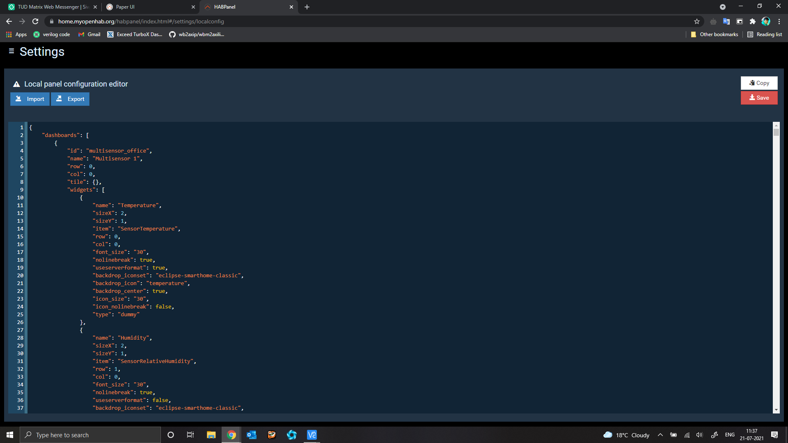

# Creating Habpanel from Json script 
Import .json file into the local storage habpanel config file in Habpanel to create the Habpanels directly using Json script.
Follow the below steps.

1.  Go to Habpanel Settings 

2.  Click local panel confifuration 
 

3. Copy and paste the Json script and save it or Import the Json file here.
 
All Habpanels will be created using the Json script after saving it.
