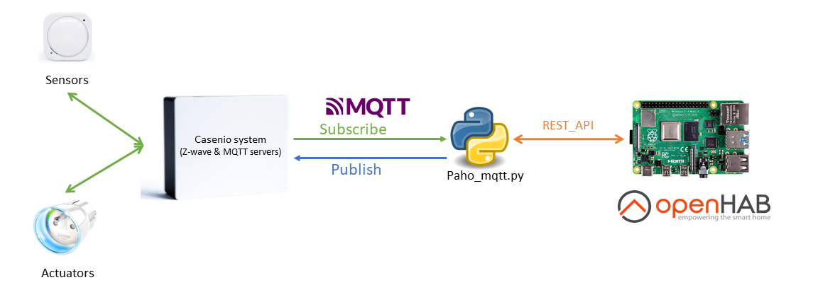

# Fassade Setup

## Fassade to Openhab communication has 3 main blocks 
1. Casenio System: 
		Sensors and actuators are connected to this Casenio system via Z-wave and MQTT.
		Casenio Systems uses MQTT to transmit data to HiveMQ cloud broker 
2. Paho MQTT :
		Using Paho_mqtt python library we create a client to HiveMQ MQTT cloud broker/server and publish/subscribe the sensors/actuators data.
		1.	Sensors and Actuators data will be sent to Openhab server(running in Rasberry Pi) using Openhab Cloud's Rest-API. [python script ](https://github.com/Jaswanth1729/Praeklima_fassade/blob/main/Software_files/paho_mqtt.py)
		2.	Actuators can be controlled from Openhab using RestAPI. [python script ](https://github.com/Jaswanth1729/Praeklima_fassade/blob/main/Software_files/actuators_MQTT.py)

3. Openhab server:
		We can control/visualize the sensors and actuator status using  Openhab's Habpanel/PaperUI. 	

Email ID for Openhab cloud service, remote.it, open weather api, HiveMQ services are 
credebtials 	|	value
----------------|-------------------
ID 		|	praeklima.tud@gmail.com
password	|	praeklima_tud@2021

### MySQL Database
Casenio systems sends Sensors/actuators data to MYSQL database in schema "tudresden" as table "events" (tudresden.events).
tudresden schema has 3 tables
1. events: Which has sensors and actuator data from MQTT server running on casenio system.
2. sensor_features: sensor features list
3. Openhab data: Openhab sends data to this tabel for every 30 seconds using sql-connector library.

credebtials 	|	value
----------------|-------------------
hostname	|	daten.praeklima.de
Port		|	3308
username 	|	tudresden
password	|	k-Dnn1Qqw.sddFI

### Casenio system
https://einrichtung.casenio.de/home
credebtials 	|	value
----------------|-------------------
hostname	|	31441144 
Port		|	casenio

